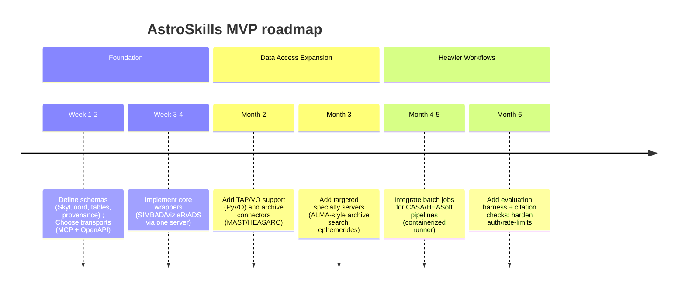

# Deep Research Report on Astrophysics Agent Skill Collections and Repositories

## Executive summary

A single, broadly-adopted “astrophysics agent skills” repository (in the same sense as a canonical marketplace of standardized, drop-in tools across agent frameworks) does **not** appear to exist today; instead, the ecosystem is **fragmented** across (a) mature astronomy Python libraries that *can be wrapped as skills* (notably the Astropy/astroquery/pyvo stack) and (b) a newer wave of **agent-native tool servers**, especially **Model Context Protocol (MCP)** servers, that directly expose astronomy APIs as callable tools. citeturn14search0turn16search0turn15search13

The clearest examples of **“skill collections”** for astronomy in an agent-native form are multi-tool MCP servers like **`aqc-mcp` (Astroquery MCP Server)**, which advertises direct HTTP/TAP access to **17+ astronomy databases** (SIMBAD, VizieR, NED, ADS, ALMA archive, HEASARC, Gaia DR3, SDSS, and more). This is the closest functional equivalent to a unified astrophysics “skills pack” discovered in this research. citeturn20view1turn22view0turn25view0

Where agent skills are “hosted” has converged on a recurring pattern: source on **GitHub**, distribution via **npm** for TypeScript MCP servers (e.g., `aqc-mcp` and multiple NASA MCP variants) and via **PyPI** for Python packages (e.g., astroquery and astronomy tooling), plus “marketplace” listings on MCP-focused catalogs (e.g., DXT.so / mcpmarket) that often point back to GitHub or npm packages. citeturn21view2turn25view0turn14search4turn15search8turn19search0

Integration paths are increasingly protocol-driven: MCP provides a standardized way to expose tools/resources/prompts to multiple agent hosts, while other ecosystems revolve around JSON-schema tool/function calling (OpenAI), plugins (Semantic Kernel), and Copilot plugins that can connect to **MCP servers or OpenAPI-described REST APIs**. citeturn16search0turn17search2turn18search0turn29search2turn29search34

## Definitions and what counts as an agent skill collection

In current agent ecosystems, a **skill** is best defined operationally as a *callable capability* that an agent can invoke with structured inputs to fetch data or perform an action outside the model. In many frameworks, “skill” is synonymous with **tool** or **plugin**, with the key properties being: clear input/output contracts, predictable side effects, and compatibility with an orchestrator loop (tool selection → invocation → observation → next step). citeturn16search14turn16search7turn17search2turn29search2

A **skill collection** (or repository of skills) typically means one of the following:

1. **Toolkit/Library of tools**: a package that ships many tool wrappers and utilities in one place (e.g., a Python library providing uniform interfaces to many astronomy archives). This is the model for astroquery as a “collection of tools to access online astronomical data,” even though astroquery is not inherently agent-native. citeturn14search0turn19search2  
2. **Agent plugin registry / marketplace**: a curated list (sometimes installable) of plugins/tools, often tied to a specific agent framework (e.g., framework-specific plugin repos or catalogs). citeturn29search23turn15search13turn15search30  
3. **Protocol-based tool server collection**: a repository of MCP servers (or similar) that expose tools over a standard protocol, enabling “write once, connect anywhere” interoperability. MCP is explicitly designed to connect LLM applications to external tools and data sources with a standardized interface. citeturn16search0turn16search1turn15search13

For this report, an **astrophysics/astronomy-focused agent skill** is counted if it meets at least one of these:

- It exposes astronomy capabilities directly as agent-callable tools (e.g., MCP server tools, framework “tool” integrations). citeturn16search0turn20view1  
- It is a widely-used astronomy software/API wrapper that can reasonably serve as a reusable skill building block (e.g., astroquery, PyVO, CASA/HEASoft entrypoints), even if not originally designed for agents. citeturn14search0turn28search3turn28search0turn28search1  

## Agent frameworks and “skills” mechanisms across platforms

### Tool-using agent loops and ReAct-style execution

A common conceptual backbone is the ReAct paradigm (interleaving reasoning traces with actions) and the broader “agent loop”: decide which tool to use, call it, incorporate observations, repeat. ReAct formalizes interleaving thought with external actions to reduce errors and improve grounding when interacting with environments like knowledge bases. citeturn16search2turn16search25

### entity["organization","LangChain","llm framework"] and “tools/toolkits”
This ecosystem defines tools as callable functions with well-defined I/O passed to a chat model; agents then decide when/with what inputs to invoke them. This framing fits astrophysics skills naturally (catalog queries, archive search, ephemerides, etc.). citeturn16search14turn16search7  
A concrete astronomy-adjacent example is its NASA toolkit integration (focused on NASA media APIs), illustrating how a domain API can be packaged as an agent tool. citeturn14search2

### entity["organization","OpenAI","ai company"]: from plugins to actions + function/tool calling
OpenAI’s earlier **ChatGPT plugins** are explicitly stated as **deprecated**, shifting attention toward programmatic tool/function calling and platform-native action mechanisms. citeturn17search1  
In the current OpenAI API framing, **function calling (tool calling)** is the primary mechanism to connect models to external systems using JSON Schema tool definitions. citeturn17search2turn17search32  
For a “skills” distribution analog within ChatGPT’s customization layer, **GPT Actions** convert natural language into structured API calls (built on function calling). citeturn17search25  
In addition, the Agents SDK positions tools and agent orchestration as first-class building blocks for agentic applications. citeturn17search3turn17search19

### entity["company","Microsoft","technology company"] Copilot extensibility: plugins that can call MCP servers or OpenAPI REST
Microsoft 365 Copilot extensibility documentation describes plugins as enabling declarative agents to interact with **MCP servers or REST APIs described with OpenAPI**, including CRUD-style actions if the backend supports them. citeturn18search0turn18search7  
This is important for astrophysics skills: it means a single astronomy MCP server (or a well-described REST API wrapper around astroquery/CASA/HEASoft workflows) can become a “Copilot plugin skill.” citeturn18search0turn16search0

### entity["company","GitHub","code hosting company"] Copilot agent mode and MCP
GitHub documentation explicitly frames MCP servers as a way to enhance Copilot agent mode by giving it access to external tools/resources without switching context. citeturn18search3turn18search22  
This makes MCP a practical interoperability surface for astronomy tools across multiple agent hosts (Copilot, Claude-compatible clients, etc.). citeturn18search3turn16search0

### AutoGPT, BabyAGI, AutoGen, Semantic Kernel
AutoGPT presents itself as a platform to build/deploy/run AI agents, and historically also supported plugin-style extensions via a separate plugins repository. citeturn29search0turn29search23  
BabyAGI’s original repo is explicitly described as archived/moved (with caution about production use), and it now serves more as an ideas/experimentation lineage than a stable “skills marketplace.” citeturn29search1turn29search5  
Semantic Kernel describes plugins as encapsulating existing APIs into a collection usable by an AI, and it also documents adding plugins directly from MCP servers—bridging MCP-distributed tools into that plugin system. citeturn29search2turn29search34  
AutoGen defines tools as executable code invoked via model-generated function calls, aligning with the general “tools as skills” paradigm used elsewhere. citeturn29search3turn29search35

## Astrophysics and astronomy skill repositories discovered

### What the landscape looks like
The discovered projects cluster into three practical categories:

- **Astronomy “capability libraries”** (not agent-specific, but the de facto substrate): astroquery, Astropy, PyVO. citeturn14search0turn28search2turn28search3  
- **Agent-native MCP servers for astronomy data access**: multi-archive servers (aqc-mcp), single-archive servers (ALMA MCP), NASA API MCP servers, celestial-mechanics/visibility servers, and literature (arXiv) servers frequently used by scientists including astronomers. citeturn20view1turn20view0turn7view0turn15search19turn9view4  
- **Community demos and hackathon artifacts** that integrate astronomy MCP servers into interactive assistants (often hosted as Hugging Face Spaces). citeturn19search0turn19search7  

image_group{"layout":"carousel","aspect_ratio":"16:9","query":["inoribea aqc-mcp GitHub screenshot","adamzacharia ALMA_MCP GitHub screenshot","AnCode666 nasa-mcp GitHub screenshot","astropy astroquery GitHub screenshot"],"num_per_query":1}

### Comparison table of repositories and tool servers

| Project / Repo | What it is (skill form) | Primary language | License | Last update (commit or release date) | Maintainer / org | Key dependencies / packaging | Example use cases |
|---|---|---:|---:|---:|---|---|---|
| astroquery (astropy/astroquery) | Astronomy web-query toolkit (can be wrapped as agent skills; many service-specific subpackages like SIMBAD) citeturn14search0turn14search3 | Python citeturn3view7 | BSD-3-Clause citeturn3view7 | Latest commit shown Mar 12, 2026 citeturn6view0 | Astropy-affiliated community project (maintainers listed in CITATION) citeturn14search9turn28search14 | PyPI distribution implied by continuous deployment model; complements PyVO for VO standards citeturn14search3turn15search7 | Tooling layer for agents to resolve objects, query catalogs/archives, crossmatch via service modules (SIMBAD, MAST, ADS, HEASARC, etc.). citeturn14search0turn30search7 |
| aqc-mcp (inoribea/aqc-mcp) | Large “skills pack” MCP server exposing 17+ astronomy databases via direct HTTP/TAP APIs (no Python required) citeturn20view1turn21view2 | TypeScript citeturn21view2 | BSD-3-Clause citeturn21view2turn25view0 | Latest commit shown Mar 3, 2026 citeturn22view0 | inoribea (repo author) citeturn25view0 | npm package; depends on @modelcontextprotocol/sdk, express, zod, etc. citeturn25view0 | Natural-language mediated queries to SIMBAD/VizieR/NED/ADS/MAST/HEASARC/Gaia DR3/SDSS, etc., from any MCP-compatible agent host. citeturn20view1turn18search3 |
| ALMA_MCP (adamzacharia/ALMA_MCP) | MCP server providing structured access to the ALMA archive (includes custom ADQL; exposes multiple query tools) citeturn20view0turn21view0 | Python citeturn21view0 | MIT citeturn21view0 | Latest commit shown Jan 5, 2026 citeturn22view1 | Adam Zacharia Anil (lead developer) + Adele Plunkett (advisor) listed in repo citeturn21view0 | `requirements.txt`: fastmcp, alminer, pyvo, astroquery, astropy, pandas citeturn24view0 | “Has ALMA observed target X?”, cone search, frequency/resolution filtering, line coverage checks; agent-assisted proposal/observations search. citeturn20view0turn21view0 |
| astro_mcp (SandyYuan/astro_mcp) | MCP server aimed at “big-data astronomy” with DESI access + “universal astroquery integration” (early-stage) citeturn9view0turn15search2 | Python citeturn13view3 | **Unspecified in README** (“[Specify your license here]”) citeturn9view0 | Latest commit shown Jul 9, 2025 citeturn5view0 | SandyYuan (repo owner) citeturn15search2 | `requirements.txt`: mcp, pydantic, sparclclient, datalab, pandas, numpy, … citeturn13view3 | DESI SPARCL / Data Lab retrieval, “analysis-ready” data products, multi-service queries through astroquery integration (claimed). citeturn9view0turn13view3 |
| NASA-MCP (AnCode666/nasa-mcp) | MCP server exposing multiple NASA APIs (APOD, NEOs, space weather, Earth imagery, exoplanet data) citeturn7view0turn9view5 | Python citeturn7view0 | MIT citeturn7view0turn11view1 | Latest commit shown Jan 13, 2026 citeturn8view0 | AnCode666 (repo owner) citeturn7view0 | Python package config shows dependencies httpx and mcp[cli] citeturn11view1 | “Today’s APOD,” NEO flyby queries, DONKI space weather retrieval, Landsat/EPIC imagery, exoplanet archive queries for quick lookups. citeturn7view0turn9view5 |
| nasa-mcp-server (jezweb/nasa-mcp-server) | NASA open APIs MCP server with caching/rate-limit config examples; deployable via FastMCP cloud citeturn27view0turn12view1 | Python citeturn27view0 | MIT (stated in README section) citeturn27view0 | Latest commit shown Aug 18, 2025 citeturn5view2 | jezweb (repo owner) citeturn11view2 | `requirements.txt`: fastmcp, httpx, python-dotenv (and optional validation noted) citeturn12view1 | “Daily space brief” combining APOD, Mars imagery, NEO monitoring; parameterized agent workflows with env-based API keys and caching. citeturn27view0turn12view1 |
| NASA-MCP-server (ProgramComputer/NASA-MCP-server) | TypeScript MCP server for NASA APIs published on npm; uses MCP SDK and HTTP stack citeturn26view0turn5view4 | TypeScript citeturn26view0 | ISC citeturn26view0 | Latest commit shown Aug 27, 2025 citeturn5view3 | ProgramComputer (repo owner / npm scope) citeturn26view0 | npm package; depends on @modelcontextprotocol/sdk, axios/express/cors/dotenv/zod (versions blank in package.json) citeturn26view0 | Similar NASA quick-look workflows; useful as a Node MCP server alternative to Python servers for the same API surface. citeturn26view0turn15search8 |
| CelestialMCP (Rkm1999/CelestialMCP) | MCP server for celestial object positioning/visibility, rise/set, catalog info citeturn15search19turn9view2 | TypeScript citeturn26view1 | MIT citeturn9view2 | Latest commit shown Dec 21, 2025 citeturn5view1 | Rkm1999 (repo owner) citeturn15search19 | Depends on astronomy-engine, mcp-framework, csv-parse, zod citeturn26view1 | Agent-driven sky visibility checks, basic ephemerides/alt-az queries for planning, catalog-driven lookups. citeturn15search19turn26view1 |
| arxiv-mcp-server (blazickjp/arxiv-mcp-server) | MCP server for searching/downloading/reading papers from arXiv (not astronomy-only, but heavily used in astro research workflows) citeturn9view4turn6view4 | Python citeturn9view4 | **Inconsistent signals**: repo navigation shows Apache-2.0 while README and pyproject indicate MIT citeturn9view4turn13view2 | Latest commit shown Mar 15, 2026 citeturn6view4 | Pearl Labs Team (README attribution) citeturn9view4 | Python package with CLI/server patterns; exposes tools such as search_papers, download_paper, read_paper citeturn9view4turn13view2 | Literature retrieval + structured paper analysis workflows that can be incorporated into astro agents (surveying, method extraction, cite-checking). citeturn9view4turn16search20 |

**Interpretation:** the most “skills-collection-like” artifact here is **aqc-mcp**, because it consolidates a large surface area of astronomy database access behind one MCP server with a uniform protocol. astroquery remains the most mature *capability substrate*, but it is not packaged as agent skills out of the box. citeturn20view1turn14search0turn16search0

## Where astronomy skills are hosted, discovered, and distributed

Most astronomy agent skills appear to start life as open-source repos on GitHub, with distribution channels splitting by implementation language:

- **Python**: traditional astronomy tooling (astroquery, Astropy-affiliated packages) typically live on GitHub and distribute via PyPI; astroquery documentation explicitly describes a deployment model where releases are uploaded to PyPI and can include “dev” tagged prereleases. citeturn14search3turn14search0  
- **TypeScript / Node**: MCP servers often distribute via npm and/or `npx`-runnable packages (e.g., aqc-mcp configuration examples show `npx` usage, and package.jsons define `bin` entrypoints). citeturn20view1turn25view0turn26view0  

Emergent “agent skill registries” are currently more like **directories and catalogs** than authoritative repositories:

- The MCP community maintains “servers” repositories that collect reference implementations and point to community servers, providing a de facto discovery hub (general, not astronomy-specific). citeturn15search13turn16search0  
- “Awesome list” style curation exists for MCP servers, again general-purpose but useful to discover astronomy-adjacent tools when they’re added. citeturn15search30  
- Marketplace-style MCP catalogs (like DXT.so and mcpmarket) list astronomy servers such as “Astroquery MCP” and describe capabilities, often referencing GitHub/npm origin. citeturn14search4turn15search8turn15search12  

Community discussion hubs mostly reflect *usage questions* and ad hoc integration talk rather than standardized skills packaging:

- On Stack Overflow, the astroquery tag wiki frames astroquery as utilities to access online astronomical data and enumerates many supported services (SIMBAD, VizieR, HEASARC, NASA ADS, ALMA, etc.). citeturn30search7  
- The questions themselves are largely practical “how do I query X” issues (e.g., querying Gaia with lists of coordinates), which supports the conclusion that tool usage is widespread but “agent skill repositories” are not yet the dominant abstraction in that forum. citeturn30search0turn30search2  
- Reddit discussions about agent frameworks (e.g., comparing orchestration frameworks) exist, but do not currently function as structured skills registries. citeturn16search17  

## Gaps, overlap with core astronomy software, and integration paths

### Overlap with astronomy’s existing software stack

The existing astronomy ecosystem already contains highly capable “skills,” but they’re packaged for humans/programmers, not agents:

- The Astropy Project positions itself as a community effort to provide a common core package for astronomy in Python and an ecosystem of interoperable affiliated packages. citeturn28search2turn28search14  
- astroquery sits in that same ecosystem as an affiliated package focused on querying online astronomical data resources via many service-specific interfaces. citeturn14search0turn15search7  
- PyVO provides access to standard IVOA Virtual Observatory protocols (TAP, SIA, SSA, etc.), which is a natural fit for agent skills because it offers standardized query interfaces and registry-based service discovery. citeturn28search3turn28search15  
- CASA is explicitly described as the primary data processing software for radio facilities including ALMA and the VLA, representing a huge portion of operational radio astronomy workflows that are not trivially exposed as lightweight agent skills due to runtime complexity and data volume. citeturn28search0turn28search12  
- HEASoft is distributed as a unified release of FTOOLS and high-energy analysis software packages (with explicit versioning and distribution notes), again illustrating that major astrophysics workflows often live in heavy software environments rather than agent-friendly microtools. citeturn28search1turn28search5turn28search9  

### Key gaps blocking a “clean” agent skills ecosystem for astrophysics

A rigorous review of the discovered repos suggests these gaps are structural, not merely incidental:

1. **Lack of a canonical schema for astronomy tool outputs**: Most tools return heterogeneous tables/strings; even when protocols like MCP standardize the *transport*, they do not inherently standardize astrophysics-specific data models (e.g., sky coordinate frames, provenance, units). citeturn16search0turn20view1turn14search0  
2. **Heavy dependencies and compute environments**: CASA and HEASoft represent large, install-heavy environments (sometimes best run in containers or managed platforms). This complicates “skills” that require local execution. citeturn28search0turn28search5turn28search29  
3. **Authentication and rate limits**: Many astronomy services impose rate limits or require tokens (e.g., NASA API keys; ADS tokens), meaning production-grade skills need robust secret management and retry/backoff. citeturn7view0turn20view1turn27view0  
4. **Licensing and governance gaps**: Some newer repos are early-stage and may omit explicit licensing (creating friction for reuse in institutional settings). citeturn9view0  
5. **Ambiguity/noise in discovery**: Even basic keyword search can be polluted by non-astronomy “Astro” projects or semantic collisions (e.g., “Gaia” used outside the Gaia mission context), complicating repository discovery. citeturn20view2turn15search20  

### Integration paths that work today

The practical integration strategy that emerges is to treat astrophysical tooling as a “capabilities layer,” then expose it through one or more of:

- **MCP servers** (best for multi-host portability): MCP is explicitly designed to connect LLM applications with external tools and data sources using a standardized protocol, and it is actively used by agent hosts like Copilot agent mode. citeturn16search0turn18search3turn15search13  
- **JSON-schema tool/function calling** (best for OpenAI-style deployments and many frameworks): function calling lets you define structured tools for model invocation (inputs/outputs), which can wrap astroquery/PyVO/CASA calls behind stable interfaces. citeturn17search2turn17search32  
- **OpenAPI-described REST** (best for enterprise plugin systems): Microsoft 365 Copilot plugins can call REST APIs described with OpenAPI or MCP servers, meaning the same astrophysics tool surface can be offered via either route depending on deployment constraints. citeturn18search0turn18search7  
- **Semantic Kernel plugins + MCP bridging**: plugins can encapsulate existing APIs, and there is explicit documentation for adding plugins from MCP servers, making MCP an interoperability bridge. citeturn29search2turn29search34  

## Recommended next steps, architecture, and minimal viable roadmap for an astrophysics skills collection

### Recommended next steps to find/build skills (evidence-driven)

1. **Treat MCP discovery hubs as the primary “skills index”**, then filter for astronomy: MCP server directories and marketplaces already list astronomy-relevant servers (e.g., “Astroquery MCP”), while multi-archive servers like aqc-mcp show how far a consolidated skills pack can go. citeturn15search13turn14search4turn20view1  
2. **Stabilize around the Astropy ecosystem for scientific correctness**, using astroquery/PyVO as the baseline skill substrate; Stack Overflow’s astroquery tag wiki also demonstrates breadth of supported services and community familiarity. citeturn28search2turn14search0turn30search7  
3. **Identify which “heavy” workflows should be remote-only skills** (CASA, HEASoft) and decide whether to expose them as: (a) containerized remote jobs, (b) managed platforms (e.g., conda channel installs / cloud notebooks), or (c) thin wrappers around existing web services where available. citeturn28search0turn28search5  
4. **Codify a small but strict output schema** for astronomy tool calls (units, coordinate frame metadata, provenance/citation hooks), because raw tables without metadata will cause downstream reasoning errors. The need for structured tool I/O is explicit in tool-calling frameworks and in the definition of tools as well-defined inputs/outputs. citeturn16search14turn17search2turn16search0  

### Suggested architecture and APIs for “AstroSkills”

A pragmatic “AstroSkills” collection should be **protocol-first** (MCP + OpenAPI + function-calling compatibility), with an internal *capability router* that normalizes astronomy outputs into stable schemas.

```mermaid
flowchart LR
  A[Agent host\n(Copilot / OpenAI / LangChain / etc.)] -->|tool call| B[Skill Gateway]
  B -->|MCP| C[MCP Tool Servers]
  B -->|OpenAPI REST| D[REST Tool Services]
  B -->|local calls| E[In-process Skill Lib]

  C --> C1[Astronomy data access\n(aqc-mcp, ALMA MCP, NASA MCP, ...)]
  D --> D1[Institutional services\n(archive mirrors, job runners)]
  E --> E1[Python astro libs\n(astropy/astroquery/pyvo wrappers)]

  E1 --> F[(Data products)]
  C1 --> F
  D1 --> F

  F -->|normalized results + provenance| B
  B -->|structured observation| A
```

This architecture matches what current ecosystems incentivize: MCP standardizes tool-serving; function calling standardizes structured invocation; and enterprise “plugins” favor OpenAPI-described services. citeturn16search0turn17search2turn18search0turn29search34  

**API design recommendations (minimal but robust):**
- **Tool signatures**: JSON Schema inputs with explicit units/frames (e.g., ICRS vs Galactic), and outputs that always include a `provenance` object (service, query, timestamp, citation URL). This mirrors the “well-defined inputs and outputs” framing in tool definitions. citeturn16search14turn17search2  
- **Dual-mode execution**: “preview” (metadata-only, lightweight) vs “materialize” (download/cutout/compute) to prevent accidental large transfers—important because some tool docs explicitly warn of large responses. citeturn14search2turn20view1  
- **Credential policy**: env-var based injection for ADS/NASA keys (already used in existing MCP repos) plus secret-store integration for production. citeturn20view1turn7view0turn27view0  

### Minimal viable skills collection roadmap

A realistic MVP can be built in layers: start with read-only, low-risk data access skills; then add compute-heavy and write-capable actions.



This roadmap is consistent with the discovered ecosystem: multi-database MCP servers already show feasibility for read-only archive queries; heavy packages like CASA and HEASoft likely require containerized/batch execution rather than lightweight tools. citeturn20view1turn28search0turn28search1turn28search5